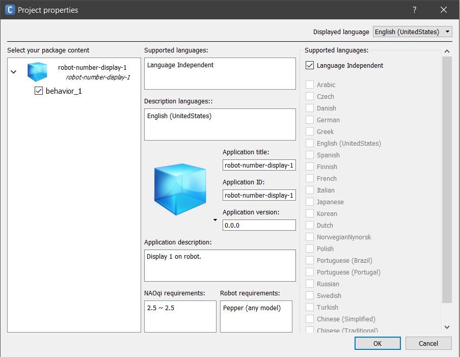
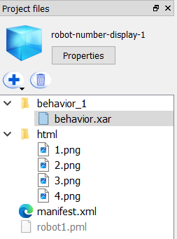
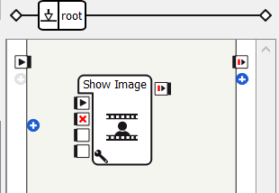
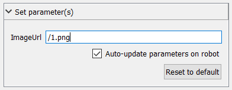
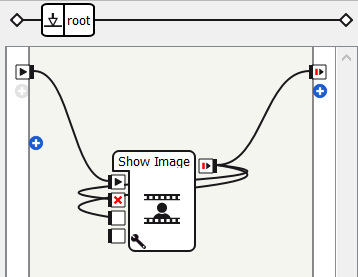
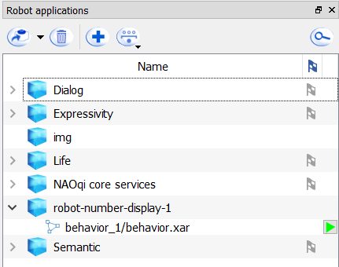
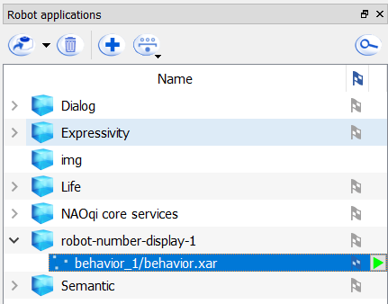

# pyRobot - a repository for easier robot coding

 


## Purpose
The purpose for this repository is to include functions that makes it easier to work with the Pepper robots, and thereby stream-lining the development of future research projects.

## Router Connection Information  
Name:     **Pepper**  
Password: **60169283**

## Pepper Robots
Username: **nao**  
106 & 110: **pepper**  
108: **Sokrates1**  
152: **salt**  
The one that does not work: **chili**

# Important Links for Pepper (NAO) after Aldebaran shutdown (2nd of June 2025)  
NAO Cloud resources: https://github.com/aldebaran  
Software Versions: https://github.com/aldebaran/nao6-binaries  
Applications and languages: https://github.com/aldebaran/nao6-apps  
Documentation: https://github.com/aldebaran/nao6-doc-sdk  


# Setting up numbers on tablets for Symbolic AI Course (and how to stop them from appearing.)
To setup the ID numbers on the robots we need to connect to the robots via Choreograph. **NOTE** that when downloading Choreograph you must ensure that the version corresponds to the version of NaoQi on the robot. Meaning if your pepper robot runs NaoQi 2.5 you must download Choreograph 2.5.X.

From my knowledge (Dennis), almost all robots at DTU run on NaoQi 2.5, though not the one from Deloitte as it runs on 2.9 (the one that stands a little wonky when turned off).

I have split the tutorial into two sections:
1. Tutorial for download: [Downloading Choregraph Suite 2.5 (and newer versions)](#downloading-choregraph-suite-25-and-newer-versions)
2. To have the robots showcase the ID upon startup we need to create a Robot Application via Choreograph and deploy it on the robot itself. See [Getting to know the robot through Choreograph](#getting-to-know-the-robot-through-choreograph) on how this is done.

* What if an application has been made, but I don't want it to show the numbers anymore? Look under [Oh no, I need it to stop...](#oh-no-i-need-it-to-stop).

## Downloading Choregraph Suite 2.5 (and newer versions) 
Something I found to be a little irritating when looking into Choreograph is how fragmented the documentation is. I discovered Choreograph 2.5.X requires a license key, whereas Choreograph 2.9.X does not. I downloaded the v.2.5 from [here](https://support.unitedrobotics.group/en/support/solutions/articles/80001024221-pepper-2-5-downloads) using the following **license-key**: 

```
654e-4564-153c-6518-2f44-7562-206e-4c60-5f47-5f45
```
found [here](https://support.unitedrobotics.group/en/support/solutions/articles/80001133061-choregraphe-licence). For newer versions of NaoQi maintained by Aldebaran i would refer to this [link](https://aldebaran.com/en/support/kb/nao6/downloads/nao6-software-downloads/).

## Getting to know the robot through Choreograph
```
For the following brief tutorials, I will be referring to som of the documentation made by Aldebaran.
```
#### Connecting to the robot
Once you have the *correct* Choreograph version downloaded, you can connect to the robot. Using Choreograph you can do two things.
1. Work on a simulated Pepper robot
2. Connect directly to a robot that you have turned on and connected to the same network as the computer you are using. 

I refer to the following tutorial, [Connecting Choregraphe to an Aldebaran robot](http://doc.aldebaran.com/2-5/software/choregraphe/connection_widget.html), to show how a connection to the robot is made.

#### Creating a Robot Application
As mentioned, a Robot Application is required in order for us to show the numbers upon startup. In Choreograph, create an empty project.

**The first step** is to access the project properties. Here you must fill in the boxes as seen in the image. Make an application title, and choose an application ID. Notice, the applications directory name will have the same name as the ID, once deployed on the robot.
```
All robot applications can be found via ssh on the robot under the following path,
/home/nao/.local/share/PackageManager/apps/
```
Choose requirements, and for this specific application with the numbers, we select *Language Independent*.



**The second step** is to add the required files to your project. Create a folder called `html` and add the image files in that folder, s.t. your file structure looks like:



**The third and last step** is to create the behavior of the application. In our case we wish for the corresponding robot to showcase either one of the images. In the `Box Libraries` view, select `Multimedia/Tablet/Show Image`, and drag it into your workspace. It should look something like this,



Now we need to set it up, such the program selects the correct image. Click on the `Show Image` frame and look a the `Inspector` view. Scroll down to the heading called *Set parameter(s)*. In the field, you simply refer to whichever image you wish to showcase. **NOTE** that it automatically retrieves from the `html` directory, i.e. write the relative path. Based on my project structure I would simply write `/1.png` in the field.



Finally, we need to setup the workflow of the program such that on start-up we run the program. In the workspace pane create the following connections.
1. OnStart (robot) -> OnStart (Show Image)
2. OnStop (Show Image) -> OnStopped (Show Image)
3. OnStopped (Show Image) -> onHideImage (Show Image)
4. OnStopped (Show Image) -> OnStopped (robot)

This [link](http://doc.aldebaran.com/2-5/software/choregraphe/choregraphe_first_steps.html) explains how connections are made.

Your workspace should look something like this:



Then, go to the `Robot Applications` view. In the toolbar, click on the button that says *Package and install current project to the robot*. This should install you project to the robot. For more information on the view, look into this [link](http://doc.aldebaran.com/2-1/software/choregraphe/panels/robot_applications.html). Once it has been installed, you will be able to see it in the view,



**IMPORTANT** to have the application run on start-up, you must add the flag as seen on the right side of each application in the view. This is done by hovering your mouse on top of the behavior that you want to run, and the click on the flag that appears.



**Now restart your robot.**

## Oh no, I need it to stop...
First, follow the same steps on downloading Choreograph. There are two approaches. First, is to simply delete the application entirely, and the second is to simply deactivate and exclude it from the startup procedure of the robot. 
1. Download the Choreograph version that corresponds to the NaoQi version.
2. Go into the `Robot Applications` view.
3. Find the application that is causing the problem. If I made them (Dennis), they probably have the following naming scheme, `robot-number-display-X`.
3. (a) Select the directory and elete it via the toolbar. 
4. (b) Expand the directory view, and click on any flags that might be there causing the behaviors to run on startup.

**Now restart your robot.**
